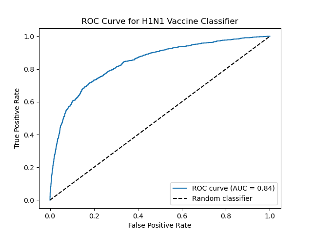
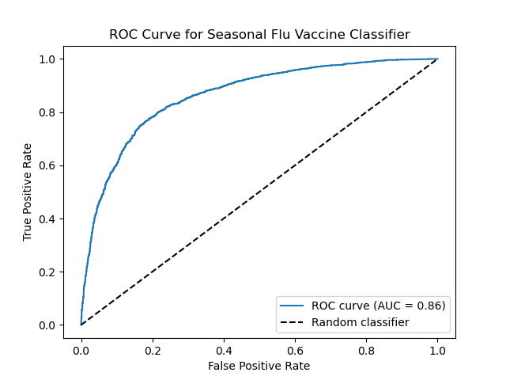

## Flu Shot Learning: Predict H1N1 and Seasonal Flu Vaccines

### Problem Statement

In this project, our aim is to predict whether individuals received H1N1 and seasonal flu vaccines based on their social, economic, and demographic background, as well as their opinions on risks of illness and vaccine effectiveness, and behaviors towards mitigating transmission.

Vaccination is a key public health measure used to fight infectious diseases by providing immunization for individuals and mitigating the  further spread of diseases in communities through herd immunity.

Original task is described in the [DrivenData competition](https://www.drivendata.org/competitions/66/flu-shot-learning/).

### Data

In the original challenge, we are provided with three CSV files:
- training_set_features.csv
- training_set_labels.csv
- test_set_features.csv

Each row in the above datasets represents an individual who was asked a set of survey questions regarding their backgrounds, opinions, and health behaviors. The files `training_set_features.csv` and `test_set_features.csv` consist of 35 categorical features representing responses to the various questions asked, along with a `respondent_id` column. The file `training_set_labels.csv` consist of two columns corresponding to the two target variables `h1n1_vaccine` and `seasonal_vaccine` that we are interested in predicting, which represents whether the respondent received the h1n1 and seasonal flu vaccines, respectively.

Since the challenge does not provide us with the test set labels, we treat the provided training set as the full data set. Thus, we split the provided training set into training and test sets to train and validate our model, as well to report the final out-of-sample performance on the test set.

### Approach to Dealing with Multi-Label Classification

Since there are two targets of interest we want to predict, this is a multi-label classification problem, where each label is binary. Thus, there are two possible approaches:

1. Predict the two labels jointly; that is, develop one model that predicts combinations of the labels. Since each target varible is binary, this will result in 4 possible outcomes, and will make this a multi-class classification problem.
2. Predict the two labels independently; that is, develop two independent models that each predict a single target. This involves training two binary classifiers.

The advantage of the first method is that the model can exploit any potential relationships between the two target variables to inform the prediction. Intuitively, we might believe that an individual is much more likely to get a second vaccine if they got the first. Thus, there is very likely some dependence betweent the labels that could improve our predictive performance. Another advantage of this method is that we only have to train a single model, rather than two separate models.

However, not all of the algorithms that we want to try for this problem (e.g. `LogisticRegression`) have multilabel support from Scikit-Learn, so we opt for the second option.

### Data Processing, Feature Importance Analysis and Feature Selection

The feature matrix was initially assessed for missing values, and it was discovered the following features had close to 50% of values missing:
- `health_insurance`
- `employment_industry`
- `employment_occupation`

Since there is no feasible way to fill in such a large quantity of missing data, we dropped these features completely from the dataset.

Additionally, all features are categorical, and were therefore, transformed into one-hot representations. This transforms the final 32 features into 107 binary features.

Two methods were employed for feature importance analysis:

1. Computing mutual information between features (prior to one-hot encoding) and the target variable of interest.
2. Training a small `RandomForestClassifier` model on the data and analyzing the feature importances from `feature_importances_`. 

However, in the end, we chose to include all features, as selecting a smaller set of features did not improve performance significantly for any of the models. In fact, including the full set of features improved performance for several models.

### Evaluation Metric

The `seasonal_vaccine` variable is fairly balanced between positive and negative examples, but the `h1n1_vaccine` variable is quite imbalanced, with approximately an 80:20 ratio of negative to positive examples. Thus, we need a metric that takes the performance on both labels into account. The area under the receiver operating characteristic (ROC) curve (AUC) is a good measure of performance on the positive and negative examples, as it considers both the true positive and false positive rates.

In order to get a single metric for the overall performance for the multi-label task, we take the mean AUC for both labels. This is implemented by using `sklearn.metrics.roc_auc_score` with the setting `average='macro'`. This is also the metric used in the original challenge.

### Final Model

We tried four classification algorithms for both problems: logistic regression, decision tree classifier, random forest classifier, and XGBoost classifier.

Hyperparameter tuning (via a randomized search over parameter grid) revealed the XGBoost classifier to be the best performing model for both the h1n1 and seasonal flu vaccine prediction tasks.

The final model achieved a mean AUC of `0.85` on the held-out test set. Below are the ROC curves for the h1n1 and seasonal flu vaccine XGBoost classifiers, respectively:





### Installing Dependencies

The dependencies for this project can be installed using `pipenv`. First, install `pipenv` using `pip`:

```
pip install pipenv
```

Then, the dependencies can be installed by first changing directory into the root folder of this project, and then running the following:

```
pipenv install
```

Note that this will create a virtual environment for this project. The virtual environment can be activated by running:

```
pipenv shell
```

### Running the Training Script

The necessary files for generating predictions are packaged as a binary file and is available at `bin/final_model.bin`. The contents (`DictVectorizer` objects and classification models for the h1n1 and seasonal flu prediction tasks, respectively) can be unpacked using `pickle.load`.

However, if one wants to re-train the models and generate the binary file, they can simply run the `train.py` script, as follows:

```
python src/train.py
```
Note that this command must be run from the project's root folder.

### Running the Flask Service and Making Predictions

There is a provided Flask web service that exposes an endpoint (`/predict`), where requests containing the relevant features of a respondent (as a JSON object) can be sent in order to generate corresponding vaccine predictions.

This service can be run with the following command:
```
gunicorn --bind=0.0.0.0:9696 src.predict:app
```
Note that this command must be run from the project's root folder.

Then, requests can be made to the model endpoint. The file `src/predict-test.py` provides an example of how such a request can be made. Simply run the following from the project's root folder:

```
python src/predict-test.py
```

### Building the Docker Image and Running the Docker Container

There is also a provided Dockerfile. Building the Docker image and running it as a container will run the prediction service within the container, and the service will be listening at port 9696.

Build the Docker image as follows:
```
docker build -t vaccine-prediction .
```
Then, run the image as a Docker container as follows:
```
docker run -it --rm -p 9696:9696 vaccine-prediction
```
The `-p 9696:9696` part of the command will forward the host's port 9696 to the container's port 9696, which is exposed in the Dockerfile.

Note that the above commands must be run from the project's root folder.

### Deploy to Cloud (AWS Elastic Beanstalk)

This application can be deployed to AWS Elastic Beanstalk with the `awsebcli` CLI tool by running the following commands:
```
eb init -p <message> -r <region> <appname>
eb create <envname>
```
The first command initializes a new Elastic Beanstalk application within the current project directory (i.e. setting up the necessary config files and prompting us to define default settings for deploying the application to EB). The second command initiates the process of creating a new deployment environment on AWS for the application by setting up the necessary infrastructure on AWS (i.e. provisioning servers, load balancing, automating scaling, etc. based on the specified configuration).

The following is an example of how one may run these commands. 
```
eb init -p "Docker running on 64bit Amazon Linux 2" -r us-east-1 vaccine-serving
eb create vaccine-serving-env --enable-spot
```
After running the above commands, and after AWS has finished setting up the environment, the CLI should output something like the following:
```
INFO    Application available at <url>
```
Then, we can simply make requests to the `/predict` endpoint at this url. The script `src/predict-test-eb.py` provides an example of how this can be done.